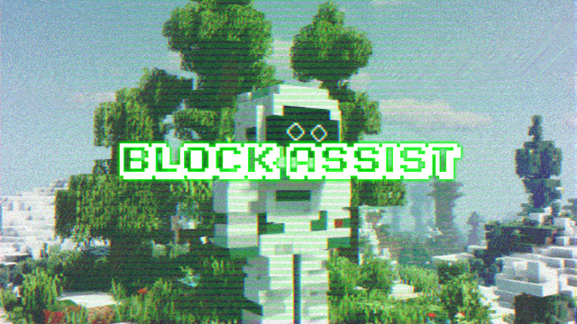

# BlockAssist

<div align="center">



</div>

**BlockAssist** is an AI assistant that learns from its user’s actions in Minecraft. The assistant appears in-game with you, starting with only basic knowledge of the game’s commands. As you play, it learns how to assist you in building, learning directly from your actions. It shows an early demo of _assistance learning_ - a new paradigm for aligning agents to human preferences across domains.

Steps:
1. Follow setup instructions below
2. Play Minecraft episodes and complete the building goal in the shortest time possible.  This will help train the best assistant models.
3. Share your progress with the community by posting your gameplay videos, stats, and Hugging Face uploads on Discord and X. Track your participation on the leaderboard.

**You do not need a copy of Minecraft to play! BlockAssist includes a free version.**

## Installation (macOS)

*You only need to run these once per computer.*

**Step 1: Clone the repo and enter the directory**

```bash
git clone https://github.com/gensyn-ai/blockassist.git
cd blockassist
```

**Step 2: Install Java 1.8.0_152**

Run the setup script:

```bash
./setup.sh
```

**Step 3: Install `pyenv`**

**Note**: This step assumes [Homebrew](https://brew.sh/) is installed on your Mac

```bash
brew update
brew install pyenv
```

**Step 4: Install Python 3.10**

```bash
pyenv install 3.10
```

**Step 5: Install `psutil` and `readchar`**

```bash
pyenv exec pip install psutil readchar
```

## Installation (Linux)

*You only need to run these once per computer.*

**Step 1: Clone the repo and enter the directory**

```bash
git clone https://github.com/gensyn-ai/blockassist.git
cd blockassist
```

**Step 2: Install Java 1.8.0_152**

Run the setup script:

```bash
./setup.sh
```

**Step 3: Install `pyenv`**

```bash
curl -fsSL https://pyenv.run | bash
```

**Note:** Follow the instructions `pyenv` prints about adding it to your shell and restart your terminal.

**Step 4: Install Python 3.10**

```bash
sudo apt update
sudo apt install make build-essential libssl-dev zlib1g-dev libbz2-dev libreadline-dev libsqlite3-dev curl git libncursesw5-dev xz-utils tk-dev libxml2-dev libxmlsec1-dev libffi-dev liblzma-dev # Dependencies for Python installation
pyenv install 3.10
```

**Step 5: Install `psutil` and `readchar`**

```bash
pip install psutil readchar
```

## Run BlockAssist

Use `ls logs` to list available log files, and `tail -f logs/<name>.log` to monitor progress. 

**Note:** when asked to press `ENTER`, you may need to do so a couple of times.

**Run with Python**

* On macOS: `pyenv exec python run.py`
* On Linux: `python run.py`

The program will install additional dependencies as required. Follow any prompts and approve any requests.

**Hugging Face Token**

You will be asked to enter a [Hugging Face](https://huggingface.co) API token. Follow [these instructions](https://huggingface.co/docs/hub/en/security-tokens) to generate one with **Write** access.


**Gensyn Testnet login**

You will be prompted to log in through your browser (`http://localhost:3000`). If you have previously logged in, this step will be skipped. Otherwise, use the browser window that opens to log in.


**Play Minecraft**

Once the Minecraft windows have loaded, the Python script will ask you to press `ENTER`.

Go to the first Minecraft window that opened (the other will be minimized on macOS). Click the window and press `ENTER` to allow it to capture your inputs. Complete the structure in-game, then return to your terminal and press `ENTER` to end the session.


**Training**

A model will now be trained and submitted to Hugging Face and to Gensyn’s smart contract.

**Review logs**

If you reach this stage in the logging window and can see a transaction in the block explorer, your submission has succeeded.

Logging window:

```
[2025-07-28 05:03:48,955][blockassist.globals][INFO] - Successfully uploaded model to HuggingFace: h-grieve/blockassist-bc-bellowing_pouncing_horse_1753675374 with size 20.00 MB
```

[Block explorer](https://gensyn-testnet.explorer.alchemy.com/address/0xE2070109A0C1e8561274E59F024301a19581d45c?tab=logs):

```
huggingFaceID
string
false
<HF-username>/blockassist-bc-bellowing_pouncing_horse_1753675374
```

The program will then end. Please close any Minecraft windows if they remain open.


## Configuration

BlockAssist uses [Hydra](https://github.com/facebookresearch/hydra) for configuration management. You can modify settings in the `config.yaml` file or override them via command-line arguments.


- `episode_count` — Controls the number of episodes. If `episode_count` is greater than 1, a new episode will start each time you press `ENTER` during session recording.

- `num_training_iters` — Controls the number of training iterations across all recorded episodes.


## Testing & Contributing

### Linting / Testing

This project relies on Ruff for formatting/linting. To format imports, run:


```bash
ruff check --select I --fix .
```

## Telemetry

This repository uploads telemetry to Gensyn services. To disable telemetry, export:

```bash
export DISABLE_TELEMETRY=1
```

**Note**: If you turn off telemetry, your contributions may not be counted towards the [BlockAssist leaderboard](https://dashboard.gensyn.ai).
